# Litres

## Проект по автоматизации тестирования интернет магазина

<p align="center">

</p>

----

### Особенности проекта:

- Удаленный запуск через Jenkins
- Отчетность в allure
- Запись логов, скриншотов и видео
- Оповещение в Telegram
- Протестированы интерфейсы web, api, mobile

### Стек проекта:

Python * Pytest * Selene * (Selenium) * Selenoid * Jenkins * Allure Report * Telegram * Intellij (PyCharm)

<p align="left">


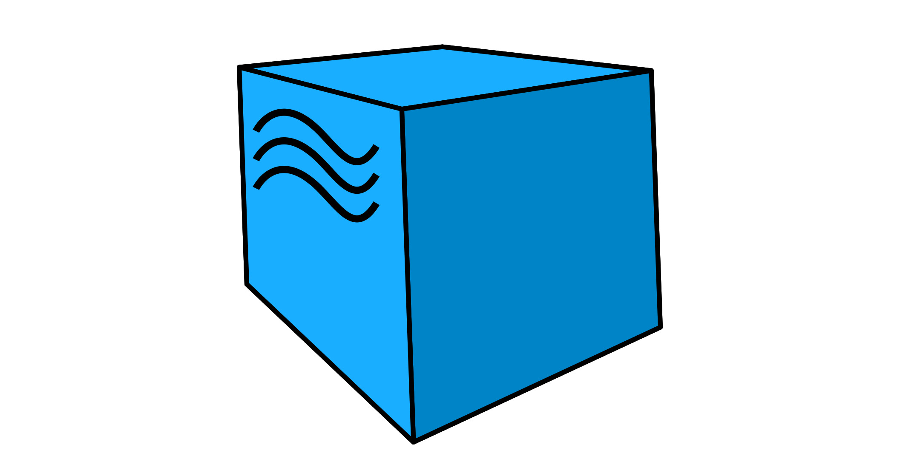


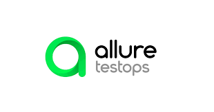
</p>

----

### Какие проверки реализованы в тестах:

#### WEB

- Корзина
-
    - Добавление книги в корзину
-
    - Удаление книги из корзины
- Избранное
-
    - Добавление книги в избранное
-
    - Удаление книги из избранного
-
    - Работа счетчика корзины и избранного
-
    - Добавление книги в отложенное через удаление из корзины
- Авторизация
-
    - Успешная авторизация
-
    - Неуспешная авторизация с неправильным паролем
-
    - Проверка почты для регистрации
-
    - Проверка почты для авторизации
- Поиск книги
-
    - Успешный поиск книги
-
    - Проверка поиска неправильного названия

#### MOBILE

- Авторизация
- Добавление книги в избранное
- Поиск книги

#### API

- Корзина
-
    - Добавление в корзину книги/нескольких книг
-
    - Отображение добавленных книг
- Авторизация
-
    - Авторизация успешная
-
    - Авторизация неуспешная
-
    - Проверка почты для регистрации
-
    - Проверка почты для авторизации
- Поиск
-
    - Поиск книги по названию
-
    - Поиск книги по неправильному названию

----

## Запуск проекта:

### Через Jenkins

Ссылка на [Ссылка на проект в Jenkins]("https://jenkins.autotests.cloud/job/Rolnik_QA_Guru_Diplom_litres/")  
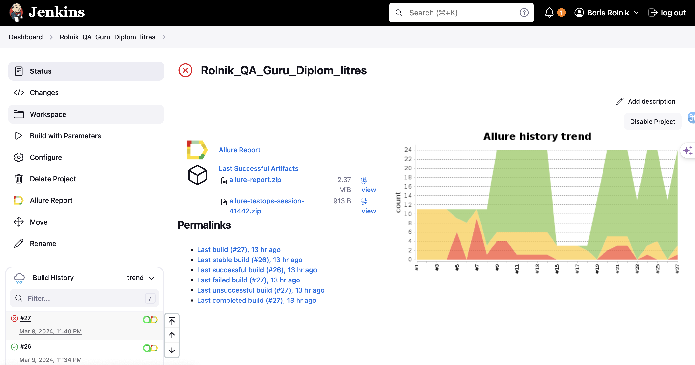

1. Нажмите на кнопку "build with parameters" (собрать с параметрами)  
   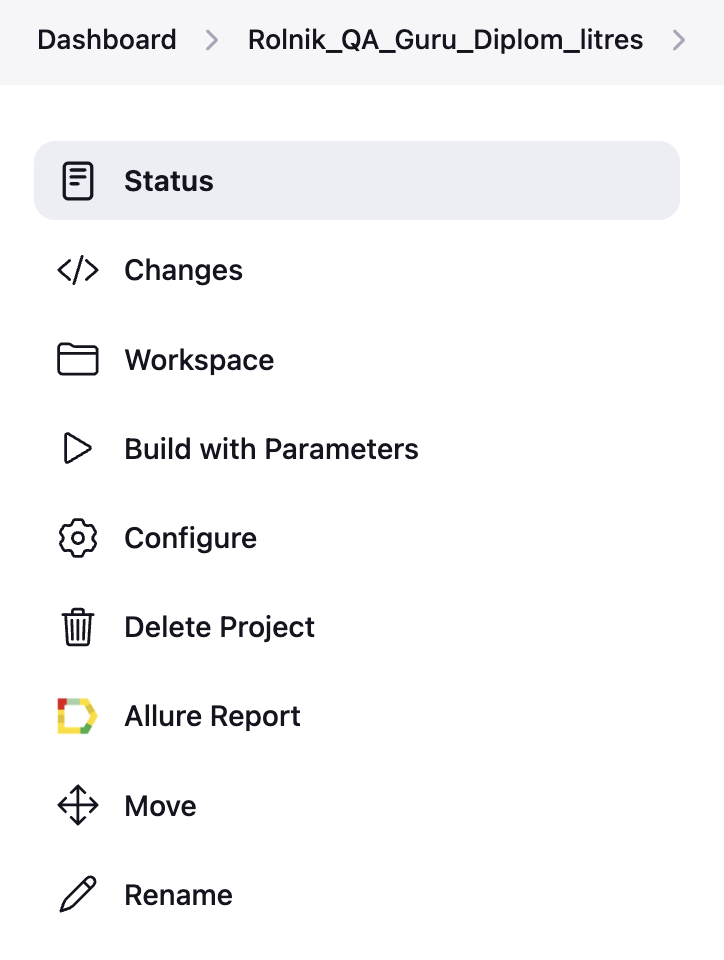
2. Выберите интерфейс тестирования. Доступны API, WEB или Mobile
   Также можно написать комментарий, который будет отправлен в Telegram после окончания сборки

- Нажмите build
  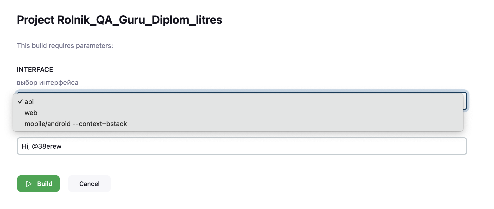

3. Когда тест будет пройден, можно посмотреть подрбности в отчете Allure  
   Для это нужно нажать на иконку allure отчета 

----

## Локальный запуск

### Настройка устройства для мобильных тестов

Более подробно можно почитать тут:
<a target="_blank" href="https://autotest.how/appium-setup-for-local-android-tutorial-md">Конспект инструкций по
настройке системы и устройств для локального запуска мобильных тестов на платформе Android</a>

### Подгтовка к запуску

1. Клонируйте репозиторий на свой компьютер при помощи git clone

  ```zsh
git clone
  ```

2. Создайте и активируйте виртуальное окружение

  ```zsh
  python -m venv .venv
  source venv/bin/activate
  ```

3. Установите зависимости с помощью pip

  ```zsh
  pip install -r requirements.txt
  ```

----

#### Для запуска WEB автотестов

используйте команду в терминале

  ```zsh
   pytest tests/web
  ```

#### Для запуска API автотестов

используйте команду в терминале

  ```zsh
   pytest tests/api
  ```

---

#### Для запуска мобильных автотестов

- Запустите сервер локально используя команду

```zsh
appium --base-path /wd/hub
  ```

##### Запуск на личном смартфоне

1. Подключите ваше устройство и включите режим разработчика на нем
2. Используйте данные из команды чтобы заполнить udid в env.local_real_device

  ```zsh
  adb devices
  ```

3. Для запуска используйте команду

  ```zsh
  pytest tests/mobile/android --context=local_real_device
  ```

4. Для получения allure отчета

  ```zsh
  allure serve allure-results
  ``` 

##### Запуск на эмуляторе

1. Запустите эмулятор через Android studio
2. Используйте данные из команды чтобы заполнить udid в env.local_emulator

  ```zsh
  adb devices
  ```

3. Для запуска используйте команду

  ```zsh
  pytest tests/mobile/android --context=local_emulator
  ```

4. Для получения allure отчета

  ```zsh
  allure serve allure-results
  ``` 

---

### Для запуска проекта через browserstack

1. Зарегистрируйтесь на сайте https://app-automate.browserstack.com/
2. Скачайте `.apk` приложение из публичного репозитория. Загрузите его в Browserstack
3. Добавьте ваши "User Name", "Access Key" и ссылку на установленное приложение в файлы env.bstack и env.credentials
4. Для запуска используйте команду

  ```zsh
  pytest --context=bstack
  ```

5. Для получения allure отчета

  ```zsh
  allure serve allure-results
  ```

---

## Отчеты

#### Структура Allure отчета

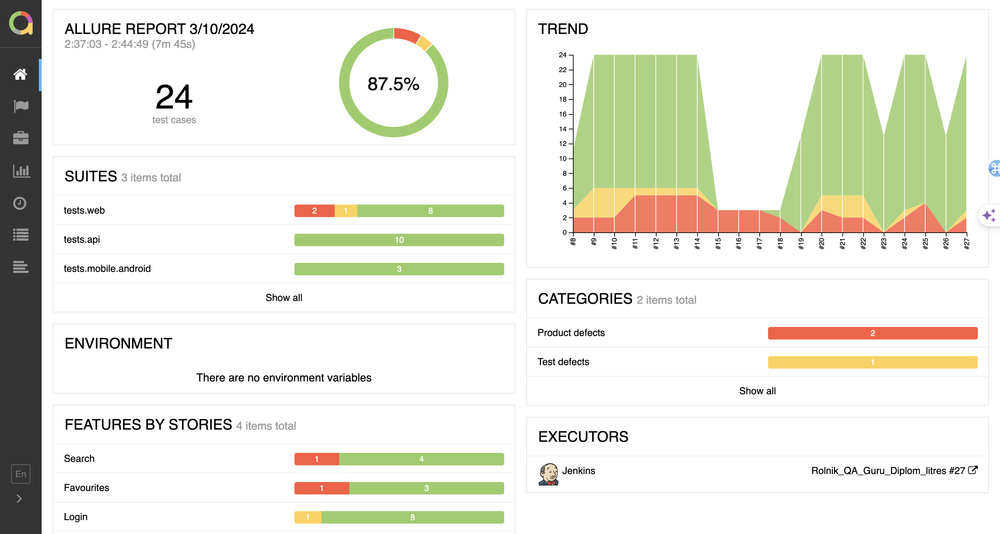

- Можно раскрыть тесты и увидеть подробности сборки

<p align="center">
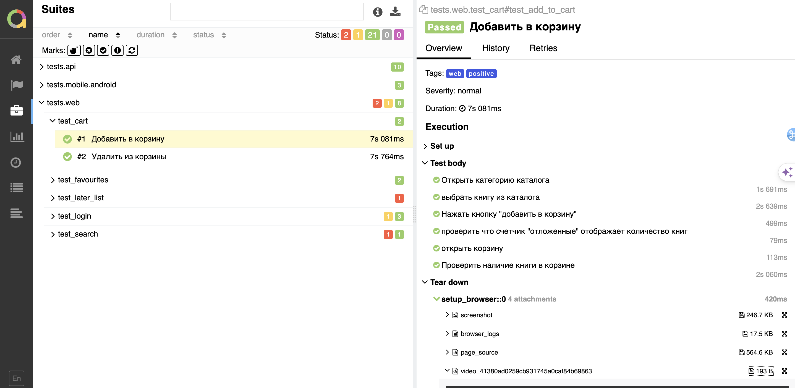
</p>
- Можно посмотреть запись прохождения теста  
<p align="center">
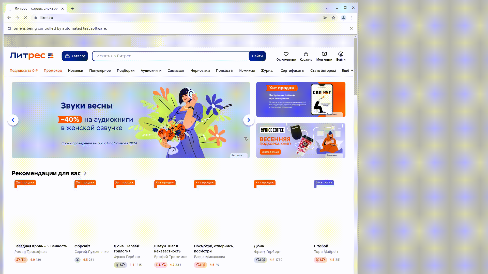
</p>

### Интеграция с Allure TestOps

> <a target="_blank" href="https://allure.autotests.cloud/project/4124/dashboards">Ссылка на проект в
> AllureTestOps</a>

<p align="center">
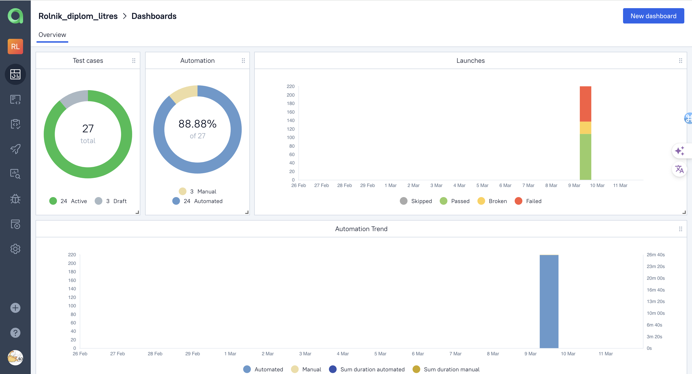
</p>

#### Cписок тест кейсов проекта

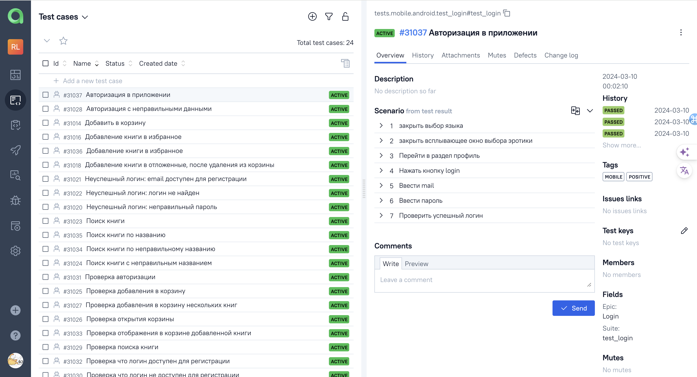

---

#### При прохождении тестов через Browserstack можно получить видео прохождения тестов

Пример:
<p align="center">
  
</p>

---

### Telegram: 

Возможна интеграция в Telegram, для более удобных оповещений.

Нужен бот в Telegram @BotFather и чат с правами администратора.
<p align="center">

</p>

Пример отчета в Telegram
<p align="center">
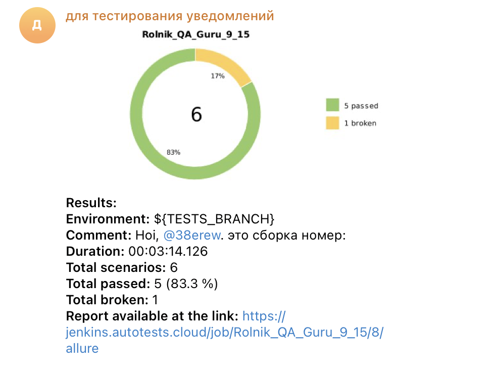
</p>
